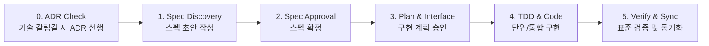

# My Space Backend - Agent Guidelines (`AGENTS.md`)

이 문서는 **My Space Backend (`my-space-backend`)** 프로젝트의 아키텍처, 기술 스택 표준, 스펙 주도 개발(SDD) 프로토콜, 인증 체계 및 AI 에이전트(Antigravity)가 작업을 수행할 때 반드시 준수해야 하는 운영 원칙과 개발 가이드라인을 정의합니다.

---

## 1. 프로젝트 개요 및 비전

### 1.1 프로젝트 목적
- **개인 맞춤형 유틸리티 백엔드 플랫폼**:
  - 개발자 개인이 일상 및 업무에서 자주 사용하는 유틸리티성 기능들을 외부 상용 서비스에 의존하지 않고 높은 자유도와 보안성을 갖추어 직접 구현하고 호스팅하는 백엔드 공간입니다.
- **점진적 확장성 (Monorepo-Ready)**:
  - 현재는 단일 NestJS 애플리케이션으로 출발하지만, 기능이 추가되고 고도화됨에 따라 **Nest CLI 표준 모노레포(`apps/`, `libs/`)** 구조로 점진적 전환을 목표로 합니다.

---

## 2. 기술 스택 및 개발 환경 표준

| 영역 | 기술 스택 | 버전 / 상세 내용 |
| :--- | :--- | :--- |
| **Framework** | NestJS | v12.0.x (최신 ESM 아키텍처) |
| **Runtime** | Node.js | v24.x (Native ESM - `"type": "module"`) |
| **Language** | TypeScript | v6.x (Nest CLI 컴파일러 API 호환성 유지) |
| **Package Manager** | pnpm | v12.x (Corepack 연동) |
| **Testing** | Vitest | v4.x (NestJS 12 기본 러너, 빠른 ESM 네이티브 테스트) |
| **Linting & Formatting** | oxlint, Prettier | 초고속 정적 분석 및 포맷팅 |
| **Logging** | Pino (`nestjs-pino`) | Loki 호환 단일 라인 JSON & 로컬 들여쓰기 JSON |
| **Authentication** | Authelia | Reverse Proxy Forward Auth 연동 |

---

## 3. 스펙 주도 개발 (SDD, Spec-Driven Development) 프로토콜

본 프로젝트는 비즈니스 무결성과 구현의 일관성을 유지하기 위해 **SDD(Spec-Driven Development, 명세 기반 개발)**와 **ADR(Architecture Decision Records, 아키텍처 의사결정 기록)**을 핵심 엔지니어링 프로토콜로 채택합니다.

### 3.1. 문서 저장소 구조

```text
docs/
├── README.md                      # 전체 문서화 가이드 및 규약
├── specs/                         # 기능 사양서 및 인터페이스 설계서
│   ├── README.md                  # 스펙 작성 규칙 및 인덱스
│   ├── template.md                # 스펙 작성 표준 템플릿
│   └── <feature-name>.md          # 도메인별 기능 스펙 문서
└── adr/                           # 아키텍처 의사결정 기록 (MADR 4.0.0)
    ├── README.md                  # ADR 인덱스 및 상태 관리
    └── template.md                # ADR 표준 템플릿
```

### 3.2. Spec vs ADR 작성 기준 (Decision Matrix)

| 구분 | **Spec (`docs/specs/`)** | **ADR (`docs/adr/`)** |
| :--- | :--- | :--- |
| **핵심 목적** | **What** — 비즈니스 요구사항 및 기능 명세 | **Why** — 기술적 갈림길에서의 대안 비교 및 결정 |
| **작성 기준** | 도메인 모델, 비즈니스 규칙(`BR-xxx`), 유스케이스, API 인터페이스 정의 시 | 프레임워크/라이브러리 도입, 인증/인프라 전략 선택, 모노레포 전환 결정 시 |
| **문서 성격** | **Living Document** (비즈니스 변경 시 지속 갱신) | **Immutable Document** (한번 승인되면 불변, 변경 시 새 번호로 신규 작성) |
| **작성 시점** | 비즈니스 기능 개발 및 도메인 리팩토링 전 | 번복하기 어려운 기술적 결정 및 구조적 변경 발생 시 |

---

### 3.3. SDD 5단계 개발 라이프사이클



1. **Step 0 — 아키텍처 결정 확인 (ADR Check)**:
   - 새로운 기술 도입, 구조 변경, 트레이드오프가 수반되는 경우 `docs/adr/`에 ADR을 먼저 작성하고 사용자 승인을 받습니다.
2. **Step 1 — 명세 초안 작성 (Spec Discovery & Draft)**:
   - 비즈니스 요구사항을 `docs/specs/<feature-name>.md` 파일에 먼저 명세합니다.
   - 필수 항목: 개요, 목표/비목표, 유스케이스(`UC-xxx`), 비즈니스 규칙(`BR-xxx`), API 인터페이스, 에러 규격, 오픈 질문.
   - 프론트매터의 상태를 `status: draft`로 설정하고 `docs/specs/README.md` 인덱스에 등록합니다.
3. **Step 2 — 스펙 검토 및 확정 (Spec Approval)**:
   - 작성된 사양서를 사용자에게 공유하고 기술적/비즈니스적 합의를 거칩니다.
   - 확정 시 상태를 `status: approved`로 변경합니다.
4. **Step 3 — 구현 계획 승인 (Implementation Plan)**:
   - 변경할 파일 범위와 구체적인 구현 접근 방식을 제시하고 승인을 받습니다.
5. **Step 4 — 구현 및 테스트 (Implementation with Tests)**:
   - 사양서의 명세와 인터페이스를 바탕으로 비즈니스 로직과 Vitest 테스트를 작성합니다.
6. **Step 5 — 표준 검증 및 스펙 동기화 (Verification & Status Update)**:
   - 빌드 및 테스트를 검증하고, 구현 완료 시 스펙 상태를 `status: implemented`로 갱신합니다.

### 3.4. 식별자 체계 (Identifier Conventions)

| 구분 | 식별자 패턴 | 예시 |
| :--- | :--- | :--- |
| **비즈니스 규칙 (Business Rules)** | `BR-<도메인이니셜><두자리숫자>` | `BR-P01` (PDF), `BR-D01` (DBML) |
| **유스케이스 (Use Cases)** | `UC-<도메인이니셜><두자리숫자>` | `UC-P01` (PDF), `UC-D01` (DBML) |
| **아키텍처 의사결정 (ADR)** | `ADR-<네자리숫자>` | `ADR-0001`, `ADR-0002` |

### 3.5. 스펙 동기화 의무 (Spec Sync Obligation)
- `docs/specs/` 하위의 사양서는 일회성 문서가 아닌 **코드베이스의 단일 진실 공급원(Single Source of Truth)**입니다.
- 인터페이스 변경이나 비즈니스 규칙 수정이 발생하면, 반드시 대응하는 스펙 문서도 같은 변경 단위로 갱신되어야 합니다.

---

## 4. 아키텍처 및 모노레포 전환 전략

### 4.1 Nest CLI 표준 모노레포 구조
향후 확장은 `nest-cli` 표준 모노레포 형태를 채택합니다:

```text
my-space-backend/
├── .agents/
│   └── AGENTS.md                  # 에이전트 가이드라인 (본 파일)
├── nest-cli.json                  # Nest CLI 설정
├── docs/                          # SDD 사양서 및 ADR
│   ├── specs/
│   └── adr/
├── apps/
│   └── api/                       # 메인 API 서버 (진입점, 라우팅, HTTP 컨트롤러)
│       └── src/
└── libs/                          # 비즈니스 도메인 및 공유 라이브러리
    ├── <feature-core>/            # 도메인별 핵심 라이브러리 (독립 순수 TS 비즈니스 로직)
    ├── auth-authelia/             # Authelia 연동 가드 및 데코레이터
    └── common/                    # 공통 예외 필터, 유틸리티, 로거
```

- **라이브러리 추출 원칙**:
  - 새로운 기능을 구현할 때 HTTP 요청 처리(컨트롤러)와 비즈니스 연산 로직을 강하게 결합하지 않습니다.
  - 서비스/도메인 로직은 독립적인 라이브러리로 분리 가능한 구조를 유지합니다.

---

## 5. 인증 및 보안 체계 (Authelia Integration)

### 5.1 연동 아키텍처: Reverse Proxy Forward Auth
Authelia는 자체 인프라의 리버스 프록시(Traefik, Nginx 등)와 연동되는 **Forward Auth 방식**을 기본으로 채택합니다.

```text
[Client] ──> [Reverse Proxy (Nginx/Traefik)] ──인증 확인──> [Authelia Server]
                    │ (인증 성공 시 헤더 주입)
                    ▼
          [NestJS Backend (My Space)]
```

### 5.2 헤더 규격 및 Guard 처리
프록시가 인증 성공 후 백엔드로 전달하는 신뢰된 HTTP 헤더를 기반으로 사용자를 식별합니다:

| 헤더 이름 | 설명 | 예시 |
| :--- | :--- | :--- |
| `Remote-User` | 사용자 고유 ID / Username | `admin` |
| `Remote-Email` | 사용자 이메일 주소 | `user@example.com` |
| `Remote-Groups` | 사용자 권한 그룹 (쉼표 구분) | `admin,developer` |
| `Remote-Name` | 사용자 실명 / 표시명 | `Keunhyeok Lim` |

- **`AutheliaAuthGuard` 표준**:
  - 요청 헤더에서 `Remote-User`를 검증하고, 유효한 경우 `req.user` 객체에 바인딩합니다.
  - 헤더가 누락되었거나 비정상인 경우 `401 Unauthorized` 예외를 발생시킵니다.
- **`@CurrentUser()` 커스텀 데코레이터**:
  - 컨트롤러에서 `req.user`를 편리하고 안전하게 주입받아 사용할 수 있도록 표준화합니다.
- **로컬 개발 바이패스 (`IS_LOCAL=true`)**:
  - 로컬 환경(`IS_LOCAL=true`)에서는 Authelia 프록시 없이도 테스트할 수 있도록, Mock 사용자(`dev-admin`)를 주입하거나 테스트용 헤더를 허용하는 방어 코드를 갖춥니다.

---

## 6. AI 에이전트(Antigravity) 작업 및 코딩 원칙

AI 에이전트는 본 프로젝트의 코드를 작성하거나 리팩토링할 때 다음 규칙을 **반드시 준수**해야 합니다:

1. **언어 정책**:
   - 모든 답변, 설명, 커밋 메시지 권고 및 생성되는 문서/아티팩트는 **한국어**로 작성합니다.
2. **스펙 우선 및 임의 추측 금지 (SDD)**:
   - 기능 구현 시 반드시 `docs/specs/` 하위의 사양서를 먼저 참조하며, 사양이 불분명하거나 존재하지 않을 경우 임의로 추측하지 않고 사용자에게 질의하거나 사양서 작성을 선행합니다.
3. **Git 커밋 직접 실행 금지 (Git Command Restriction)**:
   - 에이전트는 어떠한 경우에도 직접 `git add`, `git commit`, `git push` 등 버전을 관리하거나 커밋을 생성하는 명령을 터미널 도구로 실행해서는 안 됩니다.
   - 형상 관리는 오직 사용자가 수동으로 수행하며, 에이전트는 요청 시 커밋 메시지 추천만 제공합니다.
4. **불필요한 빌드 검증 생략 (No Redundant Validation)**:
   - 단순 문서(README.md, ADR, Spec 등 마크다운 파일) 작성이나 정적 리소스 추가와 같이 소스 코드 런타임에 부수 효과가 없는 작업은 `pnpm run build` 등의 기계적인 검증을 생략합니다.
   - 소스 코드가 변경된 경우에만 `pnpm run build` 및 `pnpm run test`를 실행합니다.
5. **ESM 모듈 임포트 규칙 (필수)**:
   - 본 프로젝트는 Node.js Native ESM(`"type": "module"`) 환경입니다.
   - 프로젝트 내부의 로컬 파일/모듈을 임포트할 때는 **반드시 `.js` 확장자를 명시**해야 합니다. (예: `import { ... } from './common/logger/logger.config.js'`)
6. **TypeScript 버전 제약**:
   - Nest CLI의 내부 컴파일러 API 호환성을 위해 TypeScript는 **6.x 버전**을 유지합니다. (7.x로 임의 업그레이드 금지)
