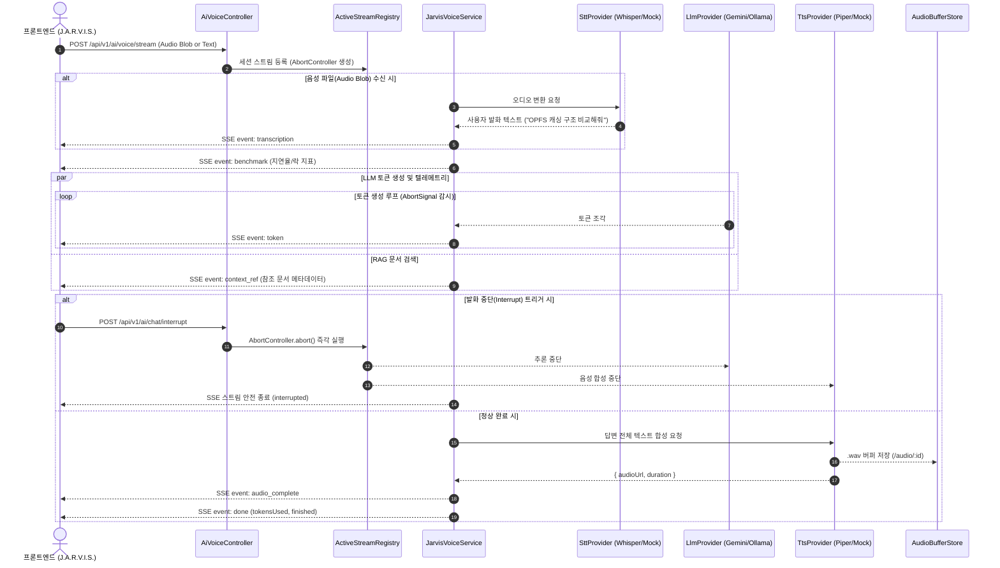

---
# MADR 4.0.0 양식 — https://adr.github.io/madr/
status: accepted
date: 2026-10-09
decision-makers: [Keunhyeok Lim]
---

# J.A.R.V.I.S. Neural Core 음성 비서 파이프라인 및 실시간 텔레메트리 스트리밍 아키텍처

## 맥락과 문제 정의 (Context and Problem Statement)

기존 `apps/ai`는 텍스트 챗봇 기반 단발성 JSON 및 텍스트 토큰 SSE 스트리밍(`POST /api/v1/ai/chat/stream`)만 제공했습니다.  
프론트엔드(`my-space-frontend`)가 Push-To-Talk(PTT), 실시간 주파수 비주얼라이저, 벤치마크 델타 카드 및 즉각적 발화 중단(Interrupt)을 갖춘 **J.A.R.V.I.S. Neural Core 음성 비서**로 전면 리디자인됨에 따라, 백엔드 또한 다음과 같은 고유한 기술적 과제들을 해결해야 합니다:

1. **실시간 음성 처리(STT/TTS) 연동 및 이종 엔진 지원**: PTT 오디오 파일(Blob)을 받아 텍스트로 변환(STT)하고, LLM 답변을 자연스러운 신경망 음성으로 합성(TTS)해야 합니다.
2. **단일 통합 SSE 스트리밍 파이프라인**: 텍스트 질의와 음성 질의를 단일 프로토콜로 수용하면서, 사용자 발화 텍스트(`transcription`), 토큰(`token`), 벤치마크 지표(`benchmark`), RAG 참조 문서(`context_ref`), 합성 오디오 완료(`audio_complete`) 이벤트를 동적으로 다중화해야 합니다.
3. **발화 즉시 중단 (Interrupt) 캔슬레이션**: 사용자가 스페이스바를 누를 때 실행 중인 LLM 추론과 TTS 합성을 수 밀리초 내에 즉시 중단(`abort`)할 수 있어야 합니다.
4. **신경망 스트림 세션 관리**: 대화의 지속성과 인터럽트 제어를 위한 세션 라이프사이클(`LIVE`, `idle`, `saved`)을 추적해야 합니다.

## 의사결정 동기 (Decision Drivers)

* **초저지연 반응성 (Low Latency Responsiveness)**: 음성 상호작용 특성상 LLM 첫 토큰 출력 및 발화 인터럽트 응답이 100ms 이내에 즉각적으로 반응해야 함.
* **유연한 플러그형 엔진 아키텍처 (Pluggable STT/TTS Engine)**: 로컬 개발 환경(Mock / 경량 엔진)과 운영 배포 환경(Piper TTS, Whisper STT, 클라우드 API) 간의 전환이 소스 코드 수정 없이 환경변수 수준에서 가능해야 함.
* **리소스 효율성 및 장애 격리 (Resource Efficiency & Fault Isolation)**: 무거운 음성 합성/변환 작업이 취소될 경우 즉시 CPU/메모리 리소스를 회수해야 하며, STT/TTS 실패가 전체 LLM 답변 생성을 완전히 중단시키지 않도록 격리되어야 함.
* **단일 진실 공급원 준수**: `BACKEND_VOICE_AI_INTERFACE.md` 규격과의 100% 인터페이스 호환성 유지.

## 검토한 대안들 (Considered Options)

### 1. 음성 엔진 연동 전략
* **대안 1-A (선택)**: **플러그형 Provider 인터페이스 (`SttProvider`, `TtsProvider`) 기반 계층화 아키텍처**
* **대안 1-B**: 특정 외부 상용 클라우드 API(OpenAI Audio / Google Cloud Speech)에 직접 강결합
* **대안 1-C**: 백엔드에서 오디오 처리를 일절 하지 않고 브라우저 Web Speech API에만 100% 위임

### 2. 세션 및 인터럽트 캔슬레이션 메커니즘
* **대안 2-A (선택)**: **In-Memory `ActiveStreamRegistry` 기반 `AbortController` 맵 관리**
* **대안 2-B**: PostgreSQL DB 상태 폴링 기반 중단 플래그 체크
* **대안 2-C**: 분산 메시지 큐(RabbitMQ / Redis PubSub) 전파 기반 인터럽트

### 3. 스트리밍 전송 프로토콜
* **대안 3-A (선택)**: **HTTP Multipart 수신 + Server-Sent Events (SSE) 응답 스트리밍**
* **대안 3-B**: 양방향 WebSocket (Full-Duplex Socket.IO) 프로토콜 전환
* **대안 3-C**: gRPC 양방향 스트리밍 프로토콜 전환

---

## 결정 내용 및 결과 (Decision Outcome)

### 선택한 안:
1. **대안 1-A (플러그형 Provider 인터페이스 채택)**:
   - `SttProvider`(오디오 Buffer ➔ 텍스트) 및 `TtsProvider`(텍스트 ➔ WAV/Opus Buffer 및 Duration) 인터페이스를 정의합니다.
   - 단계적 구현 가이드에 따라 **1단계 Mock/텍스트 모의 파이프라인**을 즉시 가동하고, **2/3단계에서 Piper/Whisper/로컬 CLI/컨테이너 어댑터**를 주입 가능한 구조로 설계합니다.
2. **대안 2-A (In-Memory `ActiveStreamRegistry` 채택)**:
   - `apps/ai` 단일 인스턴스 환경에서 가장 빠르고 확실한 중단 제어를 위해 인메모리 `Map<string, { abortController: AbortController, sessionId: string, status: AiEngineState }>`를 운영합니다.
   - `POST /api/v1/ai/chat/interrupt` 호출 시 O(1)로 `abortController.abort()`를 즉각 실행하여 진행 중인 LLM 생성 루프와 TTS 프로세스를 즉시 종료합니다.
3. **대안 3-A (Multipart + SSE 프로토콜 채택)**:
   - 기존 NestJS 인프라 및 Traefik/Authelia 리버스 프록시와의 무결성을 유지하며 추가 소켓 서버 구성 없이 HTTP 인프라를 그대로 활용합니다.
   - 단일 엔드포인트(`POST /api/v1/ai/voice/stream`)에서 오디오 파일 수신(Multer 인터셉터) 및 JSON 텍스트 질의를 모두 지원하고, 표준 SSE 포맷으로 실시간 이벤트를 전송합니다.

---

### 아키텍처 세부 다이어그램

---

### 기대 효과 및 영향 (Consequences)

#### 장점
1. **프론트엔드 완벽 호환**:
   - `BACKEND_VOICE_AI_INTERFACE.md`에 명시된 8대 SSE 이벤트(`transcription`, `token`, `audio_chunk`, `benchmark`, `context_ref`, `audio_complete`, `done`, `error`)와 인터럽트 규격을 100% 충족합니다.
2. **점진적 배포 및 유연성**:
   - 1단계(Mock 메타데이터 + 텍스트 스트리밍), 2단계(TTS 합성 연동), 3단계(STT 음성 인식)로 점진적 개발이 가능하며, 엔진 의존성을 Provider 계층으로 완전히 격리합니다.
3. **즉각적인 발화 중단 (Interrupt)**:
   - 사용자가 새로운 음성을 발화할 때 이전 발화가 즉각 캔슬되므로 불필요한 LLM 토큰 소비 및 TTS 연산 낭비를 0으로 차단합니다.

#### 트레이드오프 (감수할 점)
1. **In-Memory 세션의 다중 인스턴스 제약**:
   - 현재는 단일 `apps/ai` 인스턴스에 최적화된 인메모리 레지스트리 구조입니다. 향후 다중 Pod 로드밸런싱 도입 시 Sticky Session 또는 Redis PubSub 기반의 인터럽트 브로드캐스팅 어댑터 확장이 필요합니다.
2. **합성 오디오 스토리지 용량 관리**:
   - 생성된 WAV 파일이 메모리 또는 디스크를 점유하므로 TTL(Time-To-Live, 예: 1시간) 기반의 캐시 만료 및 정리 루틴이 필요합니다.

---

## 참고 및 관련 정보 (More Information)

* [BACKEND_VOICE_AI_INTERFACE.md](../../BACKEND_VOICE_AI_INTERFACE.md)
* [ADR-0001: Nest CLI 표준 모노레포 구조 채택 및 AI 로직 서버 독립 분리](./0001-nest-cli-monorepo-ai-service-separation.md)
* [docs/specs/jarvis-voice-assistant.md](../specs/jarvis-voice-assistant.md)
