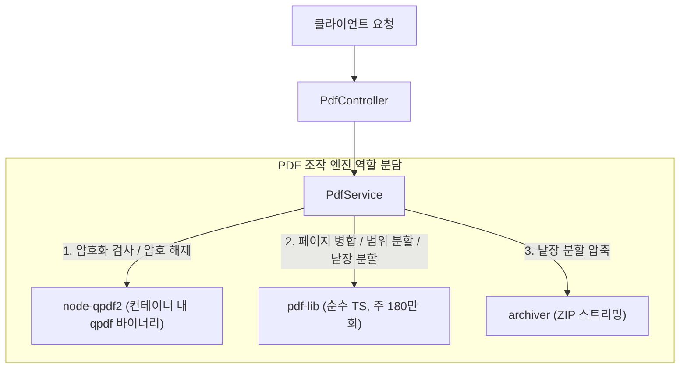

# PDF 조작 및 유틸리티 도메인 사양서 (PDF Tools Specification)

## 1. 개요 (Summary)
외부 상용 서비스(iLovePDF 등)에 민감한 문서를 업로드하지 않고, 개인 맞춤형 환경에서 PDF 문서를 안전하고 신속하게 **병합(Merge)**, **분할(Split/Extract)** 및 **암호 해제(Unlock)**할 수 있는 백엔드 API 유틸리티 서비스를 제공합니다.

## 2. 목표 및 제외 대상 (Goals / Non-goals)

### 목표 (Goals)
* **PDF 병합 (Merge)**: 2개 이상의 PDF 파일(암호화된 PDF 포함 시 비밀번호로 인증 후)을 사용자가 지정한 순서대로 하나의 PDF 문서로 결합
* **PDF 범위 분할/추출 (Split by Range)**: 단일 PDF에서 사용자가 지정한 페이지 범위(예: `1-3, 5, 8-10`)를 추출하여 단일 PDF 문서로 결합 반환
* **PDF 전체 페이지 분할 (Split to Pages)**: 단일 PDF의 모든 페이지를 개별 PDF로 분할한 뒤 단일 ZIP 아카이브로 압축하여 반환
* **PDF 암호 해제 (Unlock PDF)**: 비밀번호로 보호된 PDF의 암호를 영구적으로 제거하여 암호 없는 일반 PDF로 변환 및 다운로드
* **보호된 PDF 처리 지원**: 병합/분할 시 암호화된 PDF가 포함되어 있을 경우 비밀번호를 함께 제공하여 복호화 후 안전하게 조작 수행
* **안전한 임시 파일 및 버퍼 수명주기 관리**: `pdf-lib` 연산은 메모리 버퍼 상에서 처리하며, `node-qpdf2`의 CLI 파일 I/O는 `try-finally` 블록을 통해 작업 직후 임시 파일을 100% 즉시 파기하여 잔여 누수 방지
* **도메인 예외 및 에러 매핑**: 비밀번호 누락/불일치, 손상된 파일, 잘못된 페이지 범위 입력 시 표준 도메인 에러 반환

### 제외 대상 (Non-goals)
* 비밀번호를 모르는 상태에서의 무차별 대입(Brute-force) 크래킹

## 3. 유스케이스 (Use Cases)

| 유스케이스 ID | 액터 | 목표 | 주요 흐름 요약 |
| :--- | :--- | :--- | :--- |
| `UC-P00` | 클라이언트 | PDF 암호화 여부 및 정보 검사 | PDF 파일(및 선택적 비밀번호)을 업로드하여 암호화 여부, 총 페이지 수, 비밀번호 일치 여부를 JSON으로 확인 |
| `UC-P01` | 사용자 | 여러 PDF 파일 병합 | 2개 이상의 PDF(필요 시 비밀번호 포함)를 업로드하여 순서대로 결합된 단일 PDF 파일을 다운로드 |
| `UC-P02` | 사용자 | 특정 페이지 범위 추출 | 단일 PDF와 페이지 범위(필요 시 비밀번호 포함)를 업로드하여 해당 페이지만 모은 단일 PDF 다운로드 |
| `UC-P03` | 사용자 | 모든 페이지를 낱장 분할 | 단일 PDF(필요 시 비밀번호 포함)를 업로드하여 각 페이지별 분할 PDF들이 담긴 ZIP 아카이브를 다운로드 |
| `UC-P04` | 사용자 | PDF 암호 해제 | 암호화된 PDF와 올바른 비밀번호를 전달하여 암호가 완전히 제거된 일반 PDF 파일 다운로드 |

## 4. 비즈니스 규칙 (Business Rules)

* **`BR-P01` (파일 형식 검증)**: 모든 업로드 파일은 MIME 타입 `application/pdf` 및 유효한 PDF 매직 넘버(`%PDF-`)를 만족해야 한다.
* **`BR-P02` (병합 파일 수 제약)**: PDF 병합(`UC-P01`) 요청 시 업로드 파일은 **최소 2개 이상, 최대 20개 이하**여야 한다.
* **`BR-P03` (단일/총합 파일 크기 제약)**: 1개 파일당 최대 크기는 **50MB**, 1회 요청의 총합 크기는 **100MB**를 초과할 수 없다.
* **`BR-P04` (페이지 범위 파싱 규격)**:
  - 1-based 인덱스를 사용한다 (첫 페이지는 1).
  - 쉼표(`,`)와 하이픈(`-`)을 지원한다 (예: `'1-3, 5, 7-9'`).
  - 범위를 벗어난 페이지 번호(0 이하, 전체 페이지 초과)나 시작 페이지가 끝 페이지보다 큰 경우 `PDF_INVALID_PAGE_RANGE` 예외를 던진다.
* **`BR-P05` (암호화 PDF 인증 및 복호화)**:
  - 파일이 비밀번호로 잠겨 있는 경우, 사용자가 전달한 비밀번호로 복호화 인증을 시도한다.
  - 비밀번호가 누락된 경우 `PDF_PASSWORD_REQUIRED` 예외를 던진다.
  - 제공된 비밀번호가 일치하지 않을 경우 `PDF_INVALID_PASSWORD` 예외를 던진다.
* **`BR-P06` (암호 해제 규격)**:
  - `UC-P04` 암호 해제 시, 인증에 성공하면 User/Owner 비밀번호 및 권한 제약이 완전히 제거된 클린 PDF를 생성하여 반환한다.
  - 암호화되지 않은 일반 PDF에 대해 암호 해제를 요청한 경우 `PDF_NOT_PASSWORD_PROTECTED` 예외를 던진다.
* **`BR-P07` (PDF 사전 검사 및 암호화 확인)**:
  - `UC-P00` 검사 시, 암호화 여부(`isEncrypted`)를 판별하여 반환한다.
  - 비밀번호가 함께 전달된 경우 일치 여부(`isPasswordValid`)를 검증하여 반환한다.
  - 암호화되지 않았거나 비밀번호 인증이 완료된 경우, 전체 페이지 수(`pageCount`) 및 기본 메타데이터(제목, 작성자 등)를 응답에 포함한다.

## 5. 인터페이스 및 API 규격 (Interface / API)

### 5.1. 엔드포인트 목록

#### 1) PDF 정보 및 암호화 여부 사전 검사 (신규)
* **경로**: `POST /api/v1/pdf/inspect`
* **Content-Type**: `multipart/form-data`
* **요청 본문**:
  - `file`: `File` (필수, 검사 대상 단일 PDF)
  - `password`: `string` (선택, 암호화 검증용 비밀번호)
* **응답**:
  - **Status**: `200 OK`
  - **Content-Type**: `application/json`
  - **응답 본문 (DTO)**:
  ```json
  {
    "isEncrypted": true,
    "isPasswordValid": true,
    "pageCount": 12,
    "metadata": {
      "title": "2026 연간 사업계획서",
      "author": "홍길동"
    }
  }
  ```

#### 2) PDF 암호 해제
* **경로**: `POST /api/v1/pdf/unlock`
* **Content-Type**: `multipart/form-data`
* **요청 본문**:
  - `file`: `File` (필수, 암호화된 단일 PDF)
  - `password`: `string` (필수, 복호화용 비밀번호)
* **응답**:
  - **Status**: `200 OK`
  - **Content-Type**: `application/pdf`
  - **Content-Disposition**: `attachment; filename="unlocked.pdf"`

#### 3) PDF 병합
* **경로**: `POST /api/v1/pdf/merge`
* **Content-Type**: `multipart/form-data`
* **요청 본문**:
  - `files`: `File[]` (필수, 2~20개 PDF 파일)
  - `passwords`: `string[]` (선택, 각 파일의 비밀번호 배열. 암호 없는 파일은 빈 문자열 또는 null)
* **응답**:
  - **Status**: `200 OK`
  - **Content-Type**: `application/pdf`
  - **Content-Disposition**: `attachment; filename="merged.pdf"`

#### 4) PDF 범위 분할 및 추출
* **경로**: `POST /api/v1/pdf/split/range`
* **Content-Type**: `multipart/form-data`
* **요청 본문**:
  - `file`: `File` (필수, 단일 PDF 파일)
  - `ranges`: `string` (필수, 예: `'1-3, 5'`)
  - `password`: `string` (선택, 암호화된 문서인 경우 필수)
* **응답**:
  - **Status**: `200 OK`
  - **Content-Type**: `application/pdf`
  - **Content-Disposition**: `attachment; filename="extracted.pdf"`

#### 5) PDF 전체 페이지 분할 (ZIP)
* **경로**: `POST /api/v1/pdf/split/all`
* **Content-Type**: `multipart/form-data`
* **요청 본문**:
  - `file`: `File` (필수, 단일 PDF 파일)
  - `password`: `string` (선택, 암호화된 문서인 경우 필수)
* **응답**:
  - **Status**: `200 OK`
  - **Content-Type**: `application/zip`
  - **Content-Disposition**: `attachment; filename="split-pages.zip"`

---

## 6. 예외 처리 및 에러 스펙 (Error Handling)

> [!IMPORTANT]
> 아래 에러 코드는 구현 시 `src/common/filters/domain-error-http.map.ts`에 동기화 등록되어야 합니다.

| 에러 상황 | 발생 예외 클래스 | 에러 코드 (`code`) | HTTP Status | DOMAIN_ERROR_HTTP_MAP 등록 |
| :--- | :--- | :--- | :--- | :--- |
| 암호화된 PDF이나 비밀번호 미제공 | `PdfPasswordRequiredException` | `PDF_PASSWORD_REQUIRED` | 400 Bad Request | 필수 등록 |
| 제공된 비밀번호 불일치 | `PdfInvalidPasswordException` | `PDF_INVALID_PASSWORD` | 400 Bad Request | 필수 등록 |
| 암호 해제 시 암호화되지 않은 파일 | `PdfNotProtectedException` | `PDF_NOT_PASSWORD_PROTECTED` | 400 Bad Request | 필수 등록 |
| 병합 파일 2개 미만 첨부 | `PdfFileCountException` | `PDF_MIN_FILE_COUNT_NOT_MET` | 400 Bad Request | 필수 등록 |
| 최대 파일 개수(20개) 초과 | `PdfFileCountException` | `PDF_MAX_FILE_COUNT_EXCEEDED` | 400 Bad Request | 필수 등록 |
| 파일 용량 한도 초과 | `PdfFileSizeExceededException` | `PDF_FILE_SIZE_EXCEEDED` | 413 Payload Too Large | 필수 등록 |
| 유효하지 않은 페이지 범위 | `PdfInvalidPageRangeException` | `PDF_INVALID_PAGE_RANGE` | 400 Bad Request | 필수 등록 |
| 손상되었거나 유효하지 않은 PDF | `PdfCorruptedFileException` | `PDF_CORRUPTED_FILE` | 422 Unprocessable Entity | 불필요 (기본값) |

---

## 7. 기술 스택 및 코어 엔진 선정 (Engine Selection & Architecture)

### 7.1. 패키지 선정 기준 (Selection Criteria)
1. **다운로드 수 및 생태계 신뢰도 (1순위)**: 수년간 검증된 주류 생태계 패키지 우선 검토. 유지보수 연속성과 커뮤니티 검증 필수.
2. **기능 지원 완결성 (1순위)**:
   - 암호화 여부 사전 감지 및 비밀번호 일치 검증 (`inspect`)
   - 비밀번호를 통한 암호 영구 해제 및 클린 PDF 재저장 (`unlock`)
   - 2개 이상 파일의 순차적 병합 (`merge`)
   - 특정 페이지 범위 추출 및 전체 페이지 낱장 분할 (`split`)
3. **배포 환경 적합성 (Docker 컨테이너)**:
   - 윈도우 데스크탑 등 타깃 환경에 배포되더라도 **도커(Docker) 컨테이너** 내부에서 구동되므로, 컨테이너 내 리눅스 의존성(`apt-get install -y qpdf`)을 통해 호스트 OS 종속성 없이 일관된 동작 보장.

### 7.2. 고려했던 후보군 비교 및 분석 (Evaluated Candidates)

| 라이브러리 / 도구 | 주간 다운로드 수 | 지원 기능 요약 | 분석 및 채택/탈락 사유 |
| :--- | :--- | :--- | :--- |
| **`pdf-lib`** | **약 180만 회** (압도적 1위) | PDF 병합, 범위/낱장 분할, 페이지 조작 완벽 | **[채택]** PDF 병합 및 분할 엔진으로 채택. 단, 암호화(RC4/AES)된 PDF의 복호화(Unlock)를 지원하지 못해 단독 사용 불가. |
| **`pdfjs-dist`** | **약 200만 회** (압도적 1위) | PDF 파싱, 메타데이터/텍스트 읽기, 비밀번호 인증 | **[탈락]** Mozilla Firefox 내장 '읽기 전용 뷰어' 엔진으로, 암호 해제 재저장(Unlock), 파일 수정, 병합, 분할 등 '쓰기/작성' 기능이 일체 부재. |
| **`mupdf`** | 낮음 (WASM) | 암호 해제, 병합, 렌더링 지원 | **[탈락]** AGPL-3.0 라이선스 제약 및 대용량 Wasm 번들 이슈로 제외. |
| **`node-qpdf2`**<br>+ `qpdf` (CLI) | 약 수천 회 (Wrapper)<br>*(qpdf 본체는 OS 표준 C++)* | 암호화 여부 검사(`info`), 암호 영구 해제(`decrypt`), 신규 암호화(`encrypt`) | **[채택]** AWS Lambda Chromium 메인테이너(Sparticuz)가 관리하는 현대적 TS/Promise 래퍼. Docker 컨테이너 내 `qpdf` 바이너리 연동으로 무결성 보장. |

### 7.3. 최종 아키텍처 및 역할 분담 (Final Architecture Decision)

단일 라이브러리로 모든 요구사항(암호 해제 + 병합 + 분할)을 충족할 수 없으므로, 다운로드 수와 안정성이 검증된 도구들을 기능별로 명확히 역할 분담하여 결합합니다:



1. **`node-qpdf2` (암호화/복호화 엔진)**:
   - `inspect`: 암호화 여부 및 비밀번호 유효성 검증
   - `unlock`: 비밀번호 기반 보안 핸들러 영구 제거
   - `merge`/`split` 시 암호화된 PDF가 인입될 경우, 선행 복호화 수행 후 `pdf-lib`으로 전달
2. **`pdf-lib` (페이지 조작 엔진)**:
   - `merge`: 2~20개 PDF 파일의 순차적 병합
   - `split/range`: 지정 페이지 범위 추출 결합
   - `split/all`: 전체 페이지 낱장 분할
3. **`archiver` (압축 엔진)**:
   - `split/all` 수행 시 낱장 분할된 PDF들을 메모리 스트림 상에서 단일 ZIP 파일로 압축

---

## 8. 오픈 질문 및 잔여 과제 (Decisions & Open Questions)

* [x] **비밀번호 기반 암호 해제 지원**: `POST /api/v1/pdf/unlock` 신설 및 병합/분할 시 `password(s)` 파라미터 연동 확정.
* [x] **코어 엔진 라이브러리 선정**: `node-qpdf2`(암호화/복호화) + `pdf-lib`(병합/분할) 역할 분담 조합 확정. Docker 컨테이너 내 `qpdf` 바이너리 설치.
* [ ] **병합 시 passwords 전달 포맷**: `multipart/form-data`에서 파일별 비밀번호를 인덱스 배열(`passwords: ["pw1", "", "pw2"]`) 또는 JSON 문자열 중 선호하는 방식.
